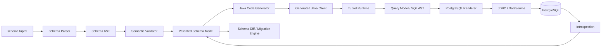

# Arquitectura do Tuprel ORM

## Visão

O Tuprel é dividido em pipelines claros em vez de um único runtime monolítico.

## Camadas

### Schema

Responsável por lexer/parser, AST, diagnostics e validação semântica. Não conhece JDBC nem Spring.

### Code generation

Transforma um schema validado em código Java determinístico. A geração deve ser reprodutível para o mesmo input e versão.

### Runtime

Executa operações através de contratos internos tipados, lifecycle de connections, statements, mapping, transactions, streaming, timeout e erros.

### SQL model e dialect

Queries devem ser representadas estruturalmente. O dialect PostgreSQL transforma essa estrutura em SQL + bind parameters. Valores não entram directamente na string SQL.

### Migration engine

Calcula diferenças conhecidas, gera/aplica migrations conforme o comando, guarda history/checksums e coordena execução concorrente.

### Introspection

Lê metadata PostgreSQL e converte-a para o modelo interno. Inputs de metadata devem ser tratados como dados, não como Java/SQL confiável.

### Integrations

Spring Boot, Gradle e Maven dependem dos contratos públicos do Tuprel. O core nunca depende deles.

## Invariantes

- parser não executa I/O de base de dados;
- codegen não abre connections;
- dialect não decide lifecycle transaccional;
- integrações não contêm lógica central que outros utilizadores precisem;
- generated client não deve depender de detalhes internos não versionados sem controlo;
- values e SQL text permanecem separados até JDBC binding;
- diagnostics nunca dependem de exibir secrets.
