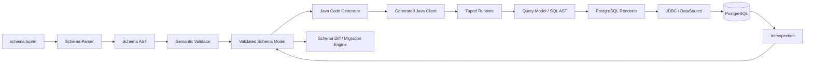

# Arquitectura do Tuprel ORM

## Visão

O Tuprel é dividido em pipelines claros em vez de um único runtime monolítico.

```mermaid
flowchart LR
    Schema[schema.tuprel] --> Parser[Schema Parser]
    Parser --> AST[Schema AST]
    AST --> Validator[Semantic Validator]
    Validator --> Model[Validated Schema Model]
    Model --> Codegen[Java Code Generator]
    Model --> Diff[Schema Diff / Migration Engine]
    Codegen --> Client[Generated Java Client]
    Client --> Runtime[Tuprel Runtime]
    Runtime --> Query[Query Model / SQL AST]
    Query --> PG[PostgreSQL Renderer]
    PG --> JDBC[JDBC / DataSource]
    JDBC --> DB[(PostgreSQL)]
    DB --> Introspection[Introspection]
    Introspection --> Model
```

## Camadas

### Schema

Responsável por lexer/parser, AST, diagnostics e validação semântica. Não conhece JDBC nem Spring.

### Code generation

Transforma um schema validado em código Java determinístico. A geração deve ser reprodutível para o mesmo input e versão.

### Runtime

Executa operações através de contratos internos tipados, lifecycle de connections, statements, mapping, transactions, streaming, timeout e erros.

Na Fase 3, o subconjunto implementado é CRUD por identificador, com
`DataSource` fornecido pela aplicação, uma connection por operação, bind de
valores tipados e row mapper síncrono. Transactions, streaming e timeout
continuam fora do contrato actual (ADR-0009).

A Fase 4 acrescenta queries estruturais e a API tipada
`dev.tuprel.runtime.query`, sobre o mesmo lifecycle. O cliente gerado por
model traduz chamadas tipadas em `ModelOperations`, que executa exactamente um
statement por método. O mapping é código gerado, sem reflection (RFC-004,
ADR-0010).

A Fase 5 acrescenta o seguinte:
- relações incluídas explicitamente, carregadas em lote com uma query por
  relação e nível (RFC-003);
- transacções explícitas: `TuprelDatabase.transaction` liga uma instância a
  uma connection, com commit/rollback, savepoints, isolamento, read-only e
  prazo;
- row locks, timeouts de statement e streaming dentro de transacções;
- batch multi-linha e optimistic locking (RFC-005, ADR-0011).

Fora de uma transacção, as regras da Fase 3 mantêm-se.

### SQL model e dialect

Queries devem ser representadas estruturalmente. O dialect PostgreSQL transforma essa estrutura em SQL + bind parameters. Valores não entram directamente na string SQL.

O renderer actual cobre CRUD por identificador (com `RETURNING` para o cliente
gerado) e queries `SELECT` estruturais: colunas explícitas, condições, ordem,
`LIMIT`/`OFFSET`, `COUNT(*)` e `EXISTS`. A política de escape de padrões
`LIKE` pertence ao dialecto, não ao modelo estrutural.

### Migration engine

Calcula diferenças conhecidas, gera/aplica migrations conforme o comando, guarda history/checksums e coordena execução concorrente.

### Introspection

Lê metadata PostgreSQL e converte-a para o modelo interno. Inputs de metadata devem ser tratados como dados, não como Java/SQL confiável.

### Integrations

Spring Boot, Gradle e Maven dependem dos contratos públicos do Tuprel. O core nunca depende deles.

## Invariantes

- parser não executa I/O de base de dados;
- codegen não abre connections;
- dialect não decide lifecycle transaccional;
- integrações não contêm lógica central que outros utilizadores precisem;
- generated client não deve depender de detalhes internos não versionados sem controlo;
- values e SQL text permanecem separados até JDBC binding;
- diagnostics nunca dependem de exibir secrets.
